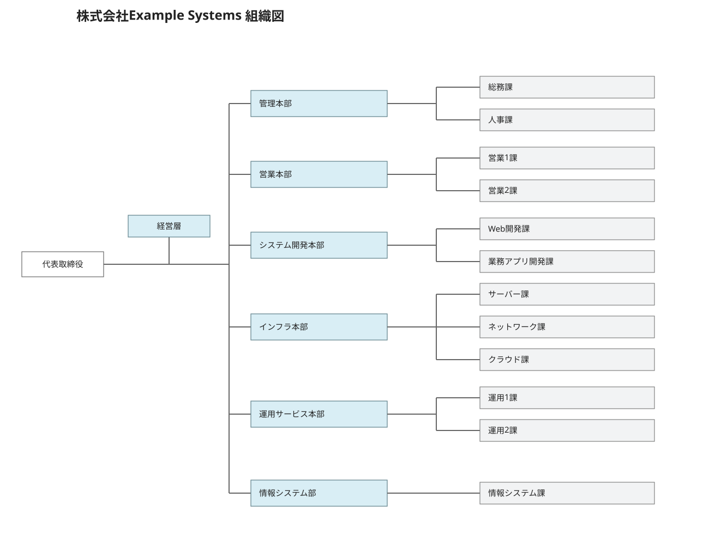
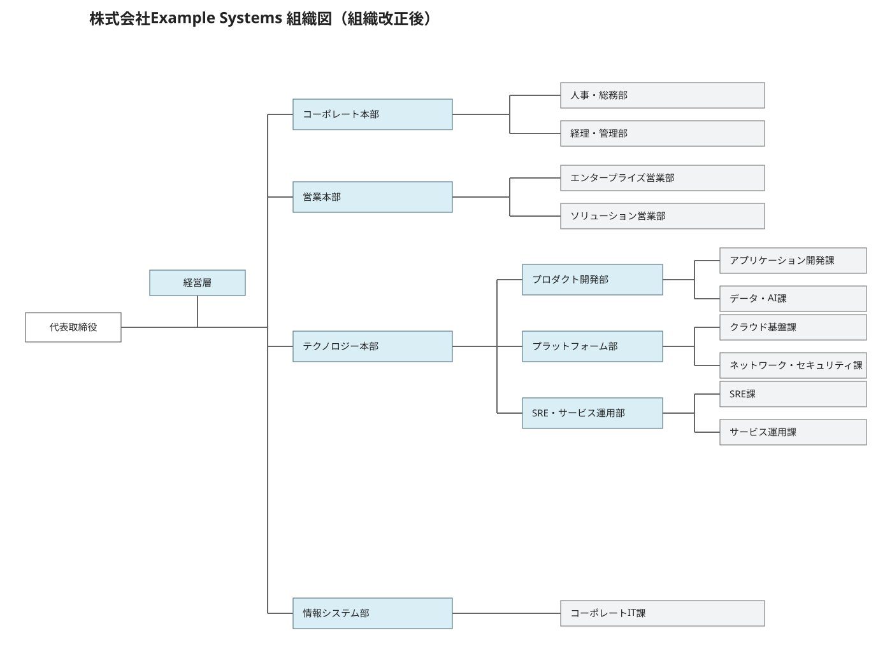

# Active DirectoryのOU設計を比較する ― 組織改正に強い設計とは

## 概要

本記事では、100名規模の架空SIer企業をActive Directory上に構築し、OU設計の違いによって、組織改正時に発生する運用作業がどの程度変わるのかを検証する。

比較するOU設計は、以下の3種類とする。

- 組織図型：組織図を基準にしたOU設計
- 役割型：ユーザー・端末・サーバーなど、管理対象の役割を基準にしたOU設計
- Tier型：役割を基準としつつ、Tier Modelを考慮したOU設計

それぞれ同一のユーザー、クライアント端末、業務サーバーを配置した環境を用意し、同一の組織改正を実施する。OUの作成・削除、オブジェクトの移動、GPOの変更などを比較し、**組織改正の影響を受けにくいOU設計を確認する。**

## 結論

検証の結果、組織図型では組織改正の影響をOU構造そのものが受けるため、OUの新規作成・削除、ユーザーやコンピューターの移動、GPOリンクの追加など多くの変更作業が発生した。

一方、役割型とTier型では、組織情報をOU構造に持たせていないため、今回の組織改正ではOU構造やGPO構成の変更は発生しなかった。

このことから、**組織改正への耐性や管理対象の整理を重視する場合は、役割型が有効**であると考えられる。

また、Tier型は組織改正時の運用効率を高めることが主目的ではなく、Tier 0 / Tier 1 / Tier 2の管理境界を分離し、特権アカウントや管理端末、重要システムを保護するための考え方である。

そのため、**通常は役割型を基本とし、より厳格な特権アクセス管理やセキュリティ境界の分離が必要な場合にTier型を考慮する**のが有効だと考える。

## 検証の背景

業務でActive DirectoryのOU設計を行う機会があり、改めて設計方針を確認することにした。

これまでは、OUは組織図に合わせて「本部 → 部 → 課」のように構成するものだと考えていた。しかしMicrosoftのドキュメントを確認すると、OUは必ずしも組織構造をそのまま表現するものではなく、GPOの適用範囲や管理対象の役割などを考慮して設計する考え方があることが分かった。

参考：[https://learn.microsoft.com/en-us/windows-server/identity/ad-ds/tier-model](https://learn.microsoft.com/en-us/windows-server/identity/ad-ds/tier-model)

そこで、組織図を基準にした設計と、組織に依存しない設計では、組織改正時の運用作業にどの程度差が出るのかを実際のActive Directory環境で確認することにした。

## 検証環境

Active Directoryの検証環境は以下とする。

| OS | Windows Server 2012 R2 |
| --- | --- |
| ホスト名 | DC01 |
| ルートドメイン名 | ad.example.test |
| NETBIOS | EXAMPLE |
| フォレスト機能レベル | Windows Server 2008 R2 |
| ドメイン機能レベル | Windows Server 2008 R2 |

## 検証対象の組織

100名規模の架空SIer企業「株式会社Example Systems」を想定し、以下の組織構成とする。



また、検証用のActive Directoryには、以下のオブジェクトを作成する。業務サーバは、業務アプリケーションサーバー、DBサーバー、ファイルサーバー、監視サーバーなどを想定する。

| 対象 | 数 |
| --- | --- |
| ユーザー | 100 |
| クライアントコンピューター | 100 |
| 業務サーバ | 10 |
| ドメインコントローラー | 1 |

## 比較するOU設計

同一の組織・ユーザー・端末・サーバーを、以下の3種類のOU構成で管理する。

| パターン | 設計基準 | 特徴 |
| --- | --- | --- |
| 組織図型 | 本部・部・課 | 実際の組織構造とOU構造を対応させる |
| 役割型 | Users / Workstations / Servers など | 組織ではなく管理対象の種類で分離する |
| Tier型 | Tier 0 / Tier 1 / Tier 2 | 管理対象をセキュリティ境界ごとに分離する |

各設計におけるOU数、GPO数、GPOリンク数は以下のとおりである。
※OU数には標準のDomain Controllers OUを含み、GPO数にはDefault Domain PolicyおよびDefault Domain Controllers Policyを含む。

| 項目 | 組織図型 | 役割型 | Tier型 |
| --- | --- | --- | --- |
| OU数 | 59 | 12 | 12 |
| GPO数 | 12 | 11 | 11 |
| GPOリンク数 | 49 | 11 | 11 |

※OU数、GPO数、GPOリンク数は以下のPowerShellコマンドで取得した。

```powershell
# OU数
(Get-ADOrganizationalUnit -Filter *).Count

# GPO数
(Get-GPO -All).Count

# GPOリンク数
[xml]$report = Get-GPOReport -All -ReportType Xml
@($report.GPOs.GPO.LinksTo).Count
```

各設計のOU構成を以下に示す。

```
【組織図方式】
ad.example.test
├─ 000.経営
│  └─ 001.経営層
│     ├─ Users
│     └─ Computers
├─ 010.管理本部
│  ├─ Users
│  ├─ Computers
│  ├─ 011.総務課
│  │  ├─ Users
│  │  └─ Computers
│  └─ 012.人事課
│     ├─ Users
│     └─ Computers
├─ 020.営業本部
...
```

```
【役割方式】
ad.example.test
├─ 100.Users
│  ├─ Administrators
│  ├─ Employees
│  └─ ServiceAccounts
└─ 200.Computers
   ├─ AdminWorkstations
   ├─ Servers
   └─ Workstations
```

```
【Tier方式】
ad.example.test
├─ Tier0
│  ├─ AdminAccounts
│  ├─ Servers
│  └─ AdminWorkstations
├─ Tier1
│  ├─ AdminAccounts
│  ├─ Servers
│  └─ AdminWorkstations
└─ Tier2
   ├─ Users
   └─ Workstations
```

## 組織改正後の組織図

組織改正後の構成は以下の通りとする。現行の「システム開発本部」「インフラ本部」「運用サービス本部」を統合し、新たに「テクノロジー本部」を設置している。



この組織改正を、組織図型・役割型・Tier型の各OU設計に適用し、変更作業を比較する。

## 組織図型における変更作業

組織図型では、組織改正後の構成に合わせて新しいOUを作成し、必要なGPOをリンクする。その後、旧OU配下のユーザー、クライアントPC、業務サーバーを新しい所属先のOUへ移動し、不要となった旧OUを削除する。

| 変更対象 | 作業内容 | 作業件数 |
| --- | --- | --- |
| OU | 新規OUを作成 | 54 |
| ユーザー | 新OUへ移動 | 96 |
| クライアントPC | 新OUへ移動 | 96 |
| 業務サーバー | 新OUへ移動 | 10 |
| GPO新規作成 | 新組織向けGPOを作成 | 2 |
| GPOリンク追加 | 新OUへ既存・新規GPOをリンク | 35 |
| 旧OU | 不要となった旧OUを削除 | 51 |

## 役割型における変更作業

役割型では、ユーザー・クライアントPC・業務サーバーを組織ではなく管理対象の種類で分離している。そのため、今回の組織改正ではOU構造およびGPOリンクの変更は発生しなかった。

## Tier型における変更作業

Tier型では、Tier 0 / Tier 1 / Tier 2というセキュリティ境界を基準にOUを構成している。今回の組織改正では各オブジェクトのTierに変更がないため、OU構造およびGPOリンクの変更は発生しなかった。

## 組織改正時の変更量比較

各OU設計について、今回の組織改正で発生した変更作業を集計すると、以下のとおりとなった。

組織図型では、組織構造そのものをOUに反映しているため、OUの新規作成・削除、ユーザーやクライアントPCの移動、GPOの追加など、多くの変更作業が発生した。

一方、役割型およびTier型では、組織情報をOU構造に持たせていないため、今回の組織改正ではOU構造やGPO構成の変更は発生しなかった。

この結果から、**組織改正への耐性という点では、役割型とTier型が組織図型より有利である**ことが分かる。

| 変更作業 | 組織図型 | 役割型 | Tier型 |
| --- | --- | --- | --- |
| OU新規作成 | 54 | 0 | 0 |
| ユーザー移動 | 96 | 0 | 0 |
| クライアントPC移動 | 96 | 0 | 0 |
| 業務サーバー移動 | 10 | 0 | 0 |
| GPO新規作成 | 2 | 0 | 0 |
| GPOリンク追加 | 35 | 0 | 0 |
| OU削除 | 51 | 0 | 0 |
| **合計作業件数** | 344 | 0 | 0 |

## 役割型とTier型の使い分け

今回の検証では、役割型とTier型の変更作業はいずれも0件となった。そのため、組織改正への耐性だけを見ると両者に大きな差はない。

では、どのような場合にTier型を選択する必要があるのだろうか。

例えば、プラットフォーム部で一般的な業務サーバーに加えて、ドメイン全体の管理に使用する特権管理サーバーを新たに管理することになったとする。ここでは、このサーバをPRIV-MGMT01とする。

この場合、役割型ではほかのサーバと同様Serversとして管理される。しかし、PRIV-MGMT01が侵害された場合、通常の業務サーバーよりも大きな影響が発生する可能性がある。このような場合はTier型を考慮し、必要となる管理権限やセキュリティ境界に応じて、以下のように分離することが考えられる。

```
Tier0
└─ Servers
   └─ PRIV-MGMT01

Tier1
└─ Servers
   ├─ APP01
   └─ FILE01
```

## まとめ

以上から、組織改正への耐性や管理のシンプルさを重視する場合は役割型が適している。一方、特権アクセスや重要システムをより厳格に分離する必要がある場合は、Tier型を考慮した設計が有効である。