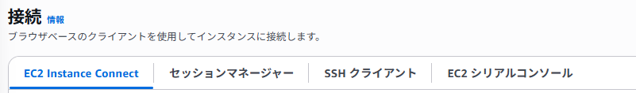
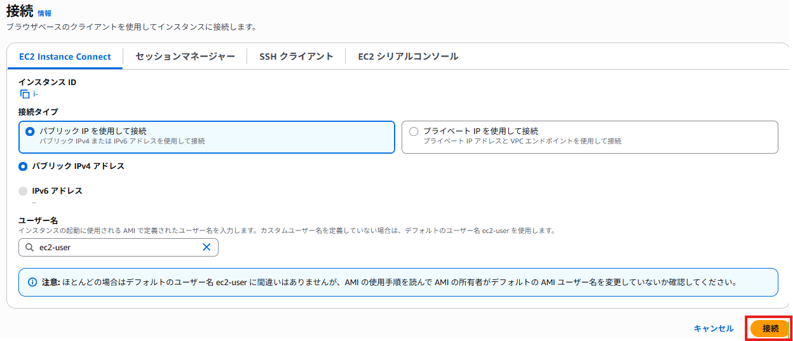
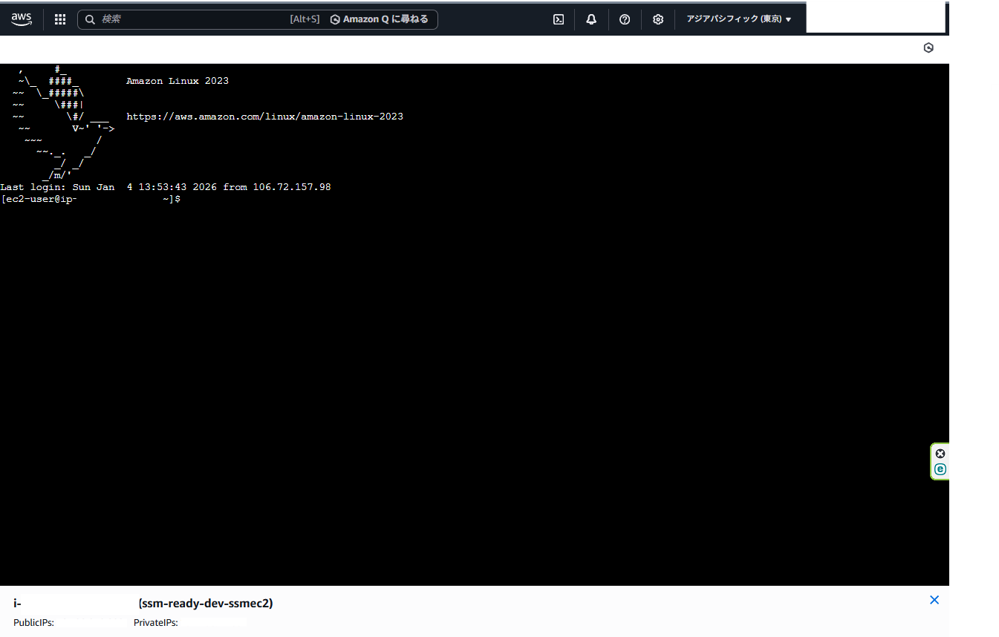
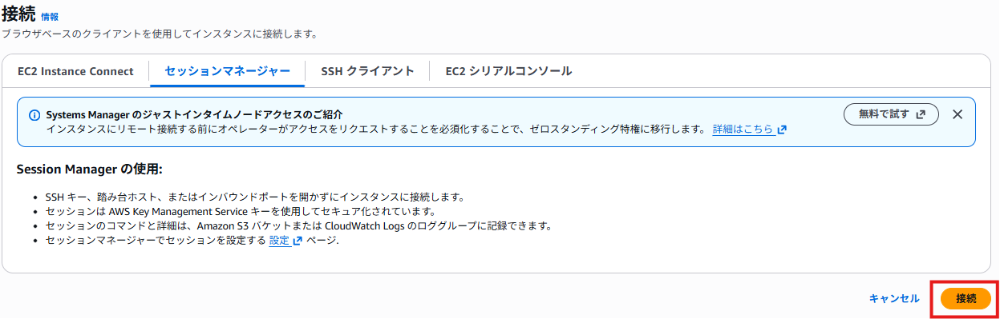
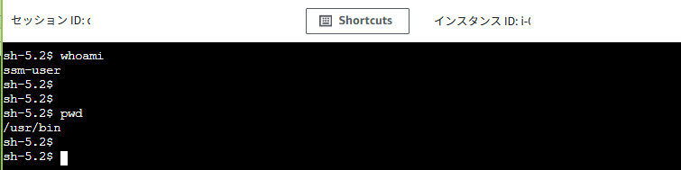
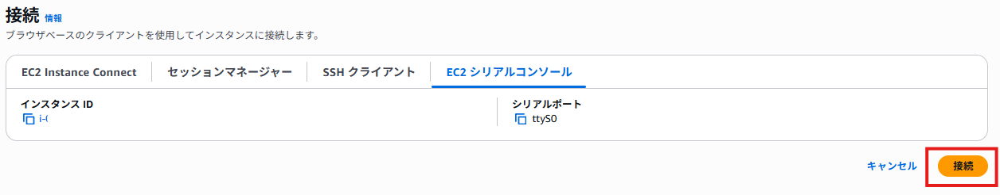
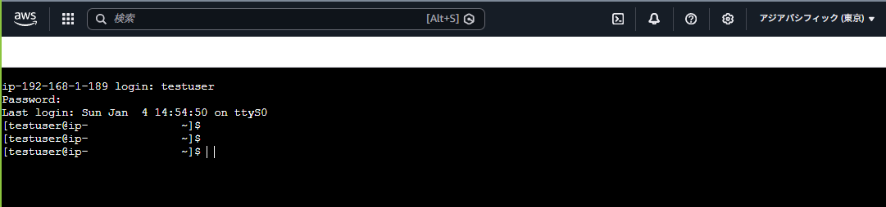

# なぜ EC2 には VMware のようなリモートコンソールが見当たらないのか

## 背景

VMware 環境では、リモートコンソールを用いて OS の起動状況確認や障害対応を行うことがあるが、同じ感覚で EC2 にも「画面に直接つながる接続」があるのか疑問に思った。

調査した結果、EC2 の接続方式は通常運用向け（SSH / Session Manager） と障害対応向け（シリアルコンソール） に明確に分かれており、VMware とは思想が異なることが分かった。本記事では、この違いを整理し「どれを選ぶべきか」を明確にする。


## 結論
- EC2 には用途の異なる複数の接続方式がある
- 通常運用は SSH / Session Manager、障害対応は シリアルコンソール
- VMware の「リモートコンソール」と同等なのは EC2 シリアルコンソール




## 前提条件

- 対象 EC2 が起動していること
- Session Manager を試す場合：SSM Managed Instance として登録されていること
    （未登録の場合は別記事「EC2 を SSM Managed Instance に認識させる」を参照）
    

## 接続方法1: SSHでのログイン

一般的な SSH ログイン。最も基本だが鍵管理と 22/tcp の開放が必要になる。

```bash
ssh -i <秘密鍵> ec2-user@<IPアドレス>
```

## 接続方法2: EC2 Instance Connect（鍵レス SSH）

SSH を使う点は同じだが、ローカルに鍵ファイルを置かずに接続できる方式。仕組みとしては「SSH公開鍵をInstance Connect API を通じて EC2 に送信し、インスタンス側で当該公開鍵を一時的に有効化することでユーザ認証を行う」というもの。以下の特徴がある。

- SSH を使う（＝通常は 22/tcp が必要）
- 鍵管理の手間を減らしたいときに向く

しかし、対応 OS が限られることや、EC2 Instance Connectパッケージが入っていることなどといった制約がある。
では実際にログインしてみよう



接続すると以下のような画面となる



## 接続方法3:セッションマネジャー（SSH不要）

SSM 経由で接続する方式。SSH ではないため、22/tcp を開けなくてもログインできる。

- インバウンド（22番）不要
- IAM でアクセス制御しやすい

では実際に試してみよう。インバウンドのルールを削除して下記のような状態となっている。ポイントは**インバウンド(22番）は不要だが、アウトバンドへの通信は許可されている**こと。

```bash
# SGを確認
aws ec2 describe-instances \
  --instance-ids i-xxxxxxxxxxxxxxxxx \
  --query 'Reservations[0].Instances[0].SecurityGroups' \
  --output table

# 実行結果（Inboundが存在しないことがわかる。ただしアウトバンドはSSMと通信するために必要。）
{                                              
    "GroupId": "sg-XXXXXXXXXXXXXXXXX",         
    "GroupName": "ssm-ready-dev-ssh-sg",       
    "VpcId": "vpc-XXXXXXXXXXXXXXXXX",          
    "Inbound": [],                             
    "Outbound": [                              
        {                                      
            "IpProtocol": "-1",                
            "IpRanges": [                      
                {                              
                    "CidrIp": "0.0.0.0/0"      
                }                              
            ],                                 
            "Ipv6Ranges": [],                  
            "PrefixListIds": [],               
            "UserIdGroupPairs": []             
        }                                      
    ]                                          
}                                              
```

以下で接続する。



接続すると以下のような画面となる。接続ユーザがssm-userになっている。



## 接続方法4:**EC2 シリアルコンソール**

「SSH でも入れない」「SSM（Session Manager）でも入れない」ときに使うのがシリアルコンソール。ただし、これを使うためには以下の要件が存在する。

- アカウント（リージョン）でシリアルコンソールを有効化
- ユーザー/ロールに **EC2 Serial Console に接続するための権限**が必要。ここではAdministartorAccess権限を持ったユーザで実行のため省略
    - [https://docs.aws.amazon.com/ja_jp/AWSEC2/latest/UserGuide/configure-access-to-serial-console.html#set-user-password](https://docs.aws.amazon.com/ja_jp/AWSEC2/latest/UserGuide/configure-access-to-serial-console.html#set-user-password)
- パスワードでログインするユーザを用意する必要がある。サンプルでtestuserというユーザを作成

その他詳細は以下参照。

参考：[https://docs.aws.amazon.com/ja_jp/AWSEC2/latest/UserGuide/ec2-serial-console-prerequisites.html](https://docs.aws.amazon.com/ja_jp/AWSEC2/latest/UserGuide/ec2-serial-console-prerequisites.html)

```bash
# アカウント（リージョン）でシリアルコンソールを有効化
## 状態確認
aws ec2 get-serial-console-access-status --region ap-northeast-1

## 有効化
aws ec2 enable-serial-console-access --region ap-northeast-1

## (無効化）
aws ec2 disable-serial-console-access --region ap-northeast-1

```

では実際にログインしてみよう



接続後Enterキーを入力するとプロンプトが現れる。



## まとめ

- **Session Manager はアウトバウンド通信が必須**
    → Inbound 不要だが完全遮断では使えない
    
- **EC2 Instance Connect は SSH 前提**
    → 鍵レスだが 22/tcp は必要
    
- **シリアルコンソールは事前有効化が必須**
    → 障害発生後では間に合わない
    
- **シリアルコンソールは IAM 権限が厳しい**
    → AdministratorAccess 以外では明示的な許可が必要

以上で検証を終了とする。
