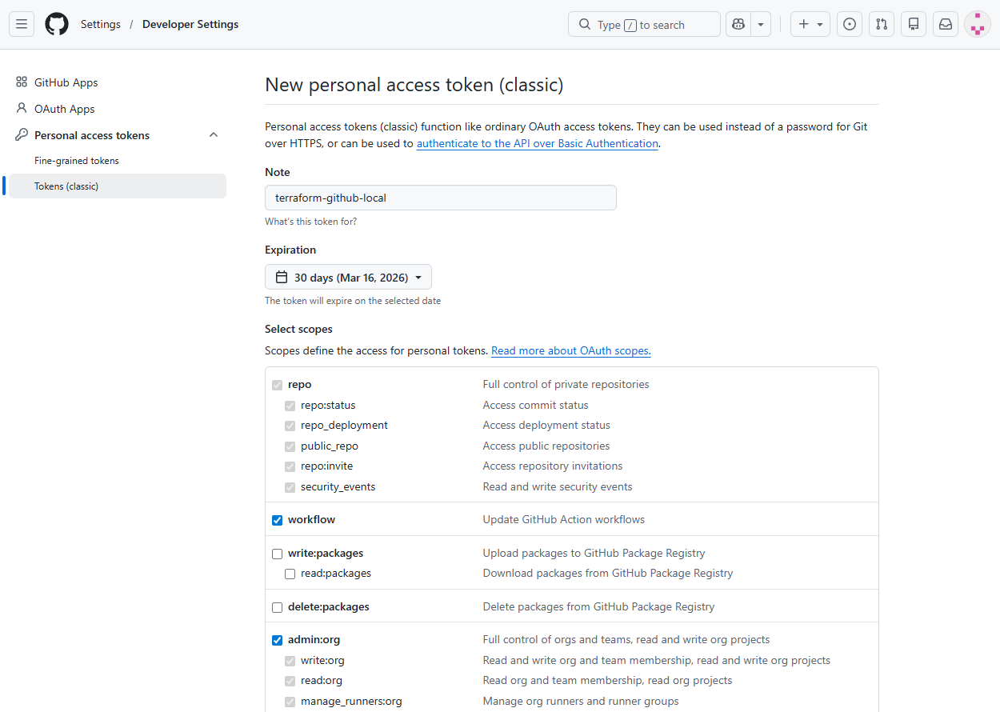
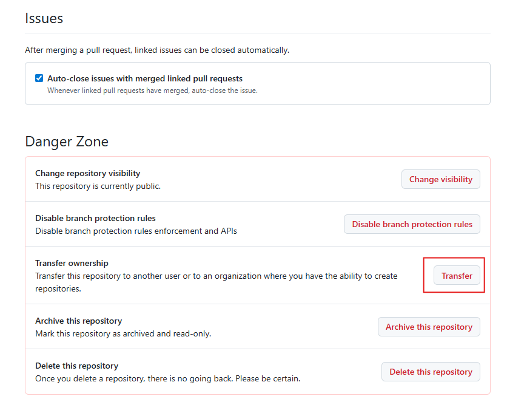
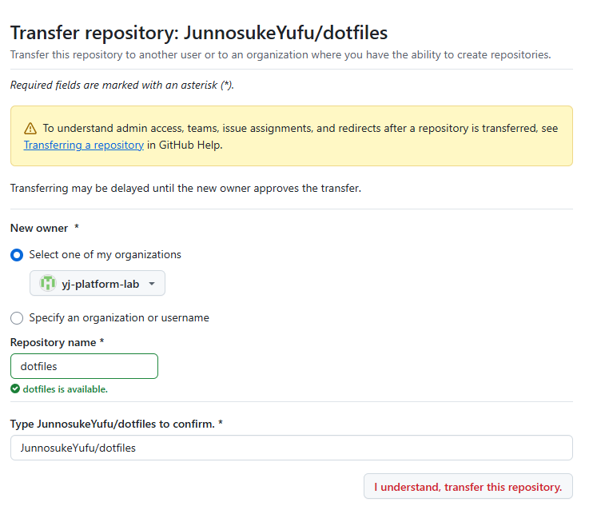
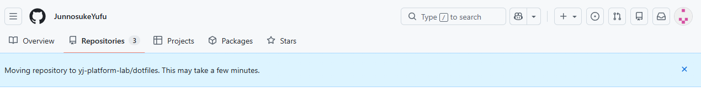

# GitHub 構成を Terraform でコード管理する ― Organization 移行と Import 検証

## 背景

これまで個人アカウント配下で複数のリポジトリ（tech-verification、work、dotfiles など）を管理してきた。

Terraform を用いた Infrastructure as Code の検証を進める中で、GitHub の Repository や権限設定をコードで管理するという事例を目にした。これをきっかけに、GitHub もまた一つの基盤として捉え、IaC の考え方を適用できるのではないかと考えた。

GitHub を手動で管理するのではなくコードとして定義できれば、構成の再現性や一貫性を担保できる。特に企業利用を想定した場合、GitHub は個人単位ではなく Organization 単位で管理されることが一般的であり、リポジトリの所有権や権限設計といった管理構造を明確に定義する必要がある。

そこで本検証では、その第一段階として個人アカウント直下の構成を見直し、Organization への移行を行ったうえで、既存リポジトリを Terraform 管理下へ取り込むことを試みる。

## 本検証の目的

本検証では以下を達成することを目的とする。

- Organization 配下へのリポジトリ移管
- 既存 Repository の Terraform への import
- Terraform による GitHub Repository の管理
- 将来的な GitHub Actions との連携を前提とした構成設計

## **現在のリポジトリ構成**

検証開始時点では、以下のリポジトリを個人アカウント直下で管理していた。

```
JunnosukeYufu（個人アカウント）
├── tech-verification (AWS や仮想化基盤などの技術検証をまとめたリポジトリ。)
├── work (業務で作成したスクリプトや検証コードなどを整理したリポジトリ。)
└── dotfiles (開発環境の設定ファイルを管理するリポジトリ。)
```

この構成は機能単位では整理されているものの、管理単位としてはすべて個人アカウント直下に存在しており、Organization を前提とした構造にはなっていなかった。

## **再設計後の構成**

GitHub を基盤として扱うため、個人アカウント直下で管理していたリポジトリを Organization 単位で再整理した。

```
JunnosukeYufu（個人アカウント）
└── yj-platform-lab（Organization） 
    ├── tech-verification
    ├── work
    ├── dotfiles
    └── github-platform-iac
```

## 変更点

- 管理スコープを「個人」から「Organization」へ変更
- リポジトリの所有主体を個人から論理的な組織単位へ移行
- GitHub基盤をコード管理するための専用リポジトリ（github-platform-iac）を追加

## 手順

### 1. Organizationの作成

はじめにOrganizationを作成する。GitHub Organization は Terraform では新規作成できないため、あらかじめ手動で作成する必要がある。

本検証では Organization 名を `yj-platform-lab` とする。ここで**Organization 名はグローバルで一意であることに注意**。またMFAの登録も行っておくこと。

### 2.PATの作成

次に、Terraform から GitHub API を操作するための認証情報として、Personal Access Token（PAT）を作成する。

① GitHub → 右上アイコン → Settings  
② Developer settings  
③ Personal access tokens  
④ Tokens (classic)　※Fine-grained ではなく classic  
⑤ Generate new token (classic)  

※トークンの設定値
有効期限：30日
スコープ選択： repo（リポジトリ作成・管理用）、admin:org（Organization配下を管理するため）、workflow（Actionsを扱うため（将来用））を許可



### 3. Organizationへ現行リポジトリの移管

次に移管したいリポジトリを今作ったOraganizationに移動する。

① 移管したいリポジトリを開く
② Settings → 一番下へスクロール
③ ページ最下部の Danger Zone - Transfer ownership において「Transfer」ボタンを押す。



④ 移管先のOrganization 名とRepository 名を入力する



⑤ 数分後、リポジトリを確認して移行が成功したことを確認。



### 4. 現行のリモートリポジトリ設定変更（オプション）

Repository 移管後も旧URLからのリダイレクトにより push は可能である。しかし、管理対象を明確にするため、各リポジトリのremote URL は Organization 配下のURLへ更新する。

```hcl
#ローカルリモートが旧URLであることを確認
git remote -v

#新しいURLに置き換え
git remote set-url origin <リポジトリ名>

#設定確認
git remote -v
```

### 5. GitHubをTerraformで管理するための最小構成作成

ローカルにgithub-platform-iacというディレクトリを作成し、以下のtfファイルを格納する。

main.tf

```hcl
resource "github_repository" "platform_iac" {
  name        = "github-platform-iac"
  description = "GitHub platform managed by Terraform"
  visibility  = "private"
}
```

provider.tf

```hcl
terraform {
  # Pin Terraform CLI version to ensure reproducible behavior
  required_version = ">= 1.5.0"

  required_providers {
    github = {
      source  = "integrations/github"
      version = "~> 6.0"
    }
  }
}

provider "github" {
  owner = "yj-platform-lab"
  token = var.github_token
}
```

variables.tf

ここでは **PATの値をファイル内に記載しないことがポイント** である。
terraform apply 実行時に、手順2で作成したPATの入力を都度求められるが、トークンをコードや tfvars に保存しない運用のほうが安全である。

```hcl
variable "github_token" {
  description = "GitHub PAT"
  type        = string
  sensitive   = true
}
```

ファイル作成後、以下を実行する。

```bash
terraform init
terraform plan
```

問題がないことを確認したうえで、`terraform apply` を実行する。

その後、GitHub上に `github-platform-iac` というリポジトリが作成されていることを確認する。

### 6. tfファイルのバージョン管理

作成したTerraform構成をGitで管理するため以下の手順を行う

```bash
# Git初期化
git init
git add .
git commit -m "bootstrap"

# ブランチ名確認（masterの場合はmainへ変更）
git branch
git branch -m master main 2>/dev/null || true

# リモート未設定であることを確認
git remote -v

# ① GitHubリポジトリを送り先として登録
git remote add origin <リポジトリ名>

# 登録確認
git remote -v

# ② 初回push（upstream設定）
git push -u origin main
```

## 7.Terraform Importによる既存リポジトリの管理化

既存の 各 リポジトリを Terraform 管理下に取り込む。

最終目標は、`terraform plan` 実行時に

```
No changes. Your infrastructure matches theconfiguration.
```

と表示される状態にすること。

ここではdotfilesを管理するとする。まず`github-platform-iac/main.tf` に追記する。

```hcl
resource "github_repository" "dotfiles" {
  name       = "dotfiles"
  visibility = "private"
}
```

※ まずは最小構成でよい（description等は後で調整）。

Terraformの定義と、既存のGitHubリポジトリを紐付ける。

```bash
# サンプルコマンド。リポジトリ名は適宜書き換えること。
terraform import github_repository.dotfiles dotfiles

# インポートに失敗する場合は、デバッグモードで原因を確認する。
TF_LOG=DEBUG terraform import github_repository.dotfiles yj-platform-lab/dotfiles
```

terraform plan で差分確認する。

Terraformは以下を比較する：

- `.tf` に書かれた定義（理想状態）
- GitHub上の実際の設定（現実状態）

差分が出る場合、それはコードと GitHubの設定が一致していない ことを意味する。

---

## 8.差分の扱い方

差分が出た場合、どちらを正とするかを決める。

### パターンA：GitHubの現状を正とする

GitHubの設定に合わせて `.tf` を修正する。

例：

```hcl
has_issues   = true
has_wiki     = true
has_projects = true
```

修正後、再度 `terraform plan` を実行し、差分がゼロになるまで調整する。

---

### パターンB：Terraformを正とする

`.tf` を正とし、GitHub側を変更する。

```bash
terraform apply
```

GitHubの設定がコードに合わせて更新される。


## 9.目標

最終的に

```bash
terraform plan
```

で

```
No changes. Your infrastructure matches theconfiguration.
```

と表示されれば、そのリポジトリは **完全にTerraform管理下に入った状態** である。
以上で移行は完了。
