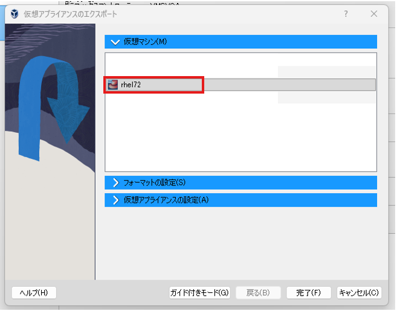
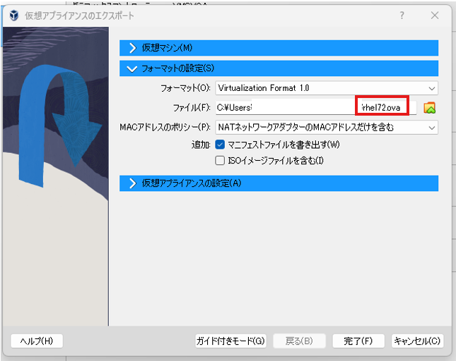

# VirtualBox仮想マシンをAWS EC2に移行する

## 概要

- **目的**: VirtualBox 上の RHEL7.2 VM を **VM Import/Export** で AMI 化し、EC2 で起動・SSH 接続まで再現する。
- **結果**: OVA → S3 → `import-image` で AMI 作成しTerraform で EC2 を起動できた。
- **要点**: 事前に **S3/IAM(VM Import 用)/VPC 基盤** を用意し、AMI は Terraform 管理外なので **data source で特定して参照**する。

## この記事で分かること

- VirtualBox VM（RHEL7.2）を **OVA にエクスポート → S3 → AMI 化**する流れ
- VM Import/Export に必要な **S3 / IAM ロール**の位置づけ
- Terraform で **基盤→EC2 起動**までを分けて再現する手順

## 検証の背景

2025/12 時点で RHEL7 はサポート終了しているが、既存システムでは短期間で OS アップデートが難しいケースがある。そこで、RHEL7 環境を維持したまま VirtualBox 上の仮想マシンを Amazon EC2 に移行する手順を検証する。

本検証では AWS の VM Import/Export を使い、VirtualBox の VM を AMI 化して EC2 上で起動・接続できる状態を再現するまでを確認する。

## 前提条件

- ローカル環境: Terraform が実行できること（基本操作が分かる）
- ローカル環境: AWS CLI が使えること
- 対象 VM: VirtualBox 上の RHEL 7.2 VM（SSH ログイン可能）
- VirtualBox: 7.0
- AWS: VM Import/Export を利用できるアカウント
- **VM Import/Export** を使用
    - [https://docs.aws.amazon.com/ja_jp/vm-import/latest/userguide/what-is-vmimport.html](https://docs.aws.amazon.com/ja_jp/vm-import/latest/userguide/what-is-vmimport.html)
- 必要権限: S3 / IAM（ロール作成）/ EC2（import-image, describe, instance 起動）/ VPC 作成
- 事前用意: AMI インポート用 S3 バケット + VM Import 用 IAM ロールを作成できること

## 手順

### Step 1. Terraform で基盤を作る

Terraformで以下のリソースをまとめて構築する。

- S3バケット（VM Import用）
- VPC
- Subnet（Public）
- Internet Gateway
- Route Table + Association
- Security Group
- IAMロール（VM Import用）
    - なぜ IAM ロールを作成する必要があるのか。
    それは後述する aws ec2 import-image によるAMI変換処理が、CLIを実行したユーザではなくAWSの VM Import/Exportサービスによって実行されるためである。そのため、S3 上の OVA にアクセスする権限をAWSサービスへ委譲する必要があり、VM Import 用の IAMロールを事前に作成する必要がある。

基盤構築に使用したTerraform設定ファイルは以下。

```hcl
# ---------------------------------------                                                                                  
# Terraform configuration                                                                                                  
# ---------------------------------------                                                                                  
terraform {                                                                                                                
  required_providers {                                                                                                     
    aws = {                                                                                                                
      source  = "hashicorp/aws"                                                                                            
      version = "~>6.0"                                                                                                    
    }                                                                                                                      
  }                                                                                                                        
}                                                                                                                          
                                                                                                                           
provider "aws" {                                                                                                           
  region = "ap-northeast-1"                                                                                                
}                                                                                                                          
                                                                                                                           
# ---------------------------------------                                                                                  
# Variables                                                                                                                
# ---------------------------------------                                                                                  
variable "project" {                                                                                                       
  type    = string                                                                                                         
  default = "vmimport-demo"                                                                                                
}                                                                                                                          
                                                                                                                           
variable "environment" {                                                                                                   
  type    = string                                                                                                         
  default = "dev"                                                                                                          
}                                                                                                                          
                                                                                                                           
# ---------------------------------------                                                                                  
# S3 bucket                                                                                                                
# ---------------------------------------                                                                                  
resource "random_string" "s3_unique_key" {                                                                                 
  length  = 6                                                                                                              
  upper   = false                                                                                                          
  lower   = true                                                                                                           
  numeric = true                                                                                                           
  special = false                                                                                                          
}                                                                                                                          
                                                                                                                           
resource "aws_s3_bucket" "s3_deploy_bucket" {                                                                              
  bucket = "${var.project}-${var.environment}-bucket-${random_string.s3_unique_key.result}"                                
}                                                                                                                          
                                                                                                                           
resource "aws_s3_bucket_public_access_block" "s3_deploy_bucket" {                                                          
  bucket                  = aws_s3_bucket.s3_deploy_bucket.id                                                              
  block_public_acls       = true                                                                                           
  block_public_policy     = true                                                                                           
  ignore_public_acls      = true                                                                                           
  restrict_public_buckets = true                                                                                           
}                                                                                                                          
                                                                                                                           
                                                                                                                           
# ---------------------------------------                                                                                  
# VPC / Subnet / Route / IGW                                                                                               
# ---------------------------------------                                                                                  
resource "aws_vpc" "vpc" {                                                                                                 
  cidr_block = "192.168.0.0/20"                                                                                            
                                                                                                                           
  tags = {                                                                                                                 
    Name    = "${var.project}-${var.environment}-vpc"                                                                      
    Project = var.project                                                                                                  
    Env     = var.environment                                                                                              
  }                                                                                                                        
}                                                                                                                          
                                                                                                                           
resource "aws_subnet" "public_subnet_1a" {                                                                                 
  vpc_id                  = aws_vpc.vpc.id                                                                                 
  cidr_block              = "192.168.1.0/24"                                                                               
  availability_zone       = "ap-northeast-1a"                                                                              
  map_public_ip_on_launch = true                                                                                           
                                                                                                                           
  tags = {                                                                                                                 
    Name    = "${var.project}-${var.environment}-public-subnet-1a"                                                         
    Project = var.project                                                                                                  
    Env     = var.environment                                                                                              
    type    = "public"                                                                                                     
  }                                                                                                                        
}                                                                                                                          
                                                                                                                           
resource "aws_route_table" "public_rt" {                                                                                   
  vpc_id = aws_vpc.vpc.id                                                                                                  
                                                                                                                           
  tags = {                                                                                                                 
    Name    = "${var.project}-${var.environment}-public-rt"                                                                
    Project = var.project                                                                                                  
    Env     = var.environment                                                                                              
    type    = "public"                                                                                                     
  }                                                                                                                        
}                                                                                                                          
                                                                                                                           
resource "aws_route_table_association" "public-rt-1a" {                                                                    
  route_table_id = aws_route_table.public_rt.id                                                                            
  subnet_id      = aws_subnet.public_subnet_1a.id                                                                          
}                                                                                                                          
                                                                                                                           
resource "aws_internet_gateway" "igw" {                                                                                    
  vpc_id = aws_vpc.vpc.id                                                                                                  
                                                                                                                           
  tags = {                                                                                                                 
    Name    = "${var.project}-${var.environment}-igw"                                                                      
    Project = var.project                                                                                                  
    Env     = var.environment                                                                                              
  }                                                                                                                        
}                                                                                                                          
                                                                                                                           
resource "aws_route" "public_rt_igw_r" {                                                                                   
  route_table_id         = aws_route_table.public_rt.id                                                                    
  destination_cidr_block = "0.0.0.0/0"                                                                                     
                                                                                                                           
  gateway_id = aws_internet_gateway.igw.id                                                                                 
}                                                                                                                          
                                                                                                                           
# ---------------------------------------                                                                                  
# Security Group                                                                                                           
# ---------------------------------------                                                                                  
resource "aws_security_group" "ssh_sg" {                                                                                   
  name        = "${var.project}-${var.environment}-ssh-sg"                                                                 
  description = "ssh security group"                                                                                       
  vpc_id      = aws_vpc.vpc.id                                                                                             
                                                                                                                           
  tags = {                                                                                                                 
    Name    = "${var.project}-${var.environment}-ssh-sg"                                                                   
    Project = var.project                                                                                                  
    Env     = var.environment                                                                                              
  }                                                                                                                        
}                                                                                                                          
                                                                                                                           
resource "aws_security_group_rule" "ssh_in" {                                                                              
  security_group_id = aws_security_group.ssh_sg.id                                                                         
  type              = "ingress"                                                                                            
  protocol          = "tcp"                                                                                                
  from_port         = 22                                                                                                   
  to_port           = 22                                                                                                   
  cidr_blocks       = ["0.0.0.0/0"]                                                                                        
}                                                                                                                          
                                                                                                                           
# ---------------------------------------                                                                                  
# IAM Role (trust policy + permissions)                                                                                    
# ---------------------------------------                                                                                  
data "aws_iam_policy_document" "vmimport_trust" {                                                                          
  statement {                                                                                                              
    effect = "Allow"                                                                                                       
                                                                                                                           
    principals {                                                                                                           
      type        = "Service"                                                                                              
      identifiers = ["vmie.amazonaws.com"]                                                                                 
    }                                                                                                                      
                                                                                                                           
    actions = ["sts:AssumeRole"]                                                                                           
                                                                                                                           
    condition {                                                                                                            
      test     = "StringEquals"                                                                                            
      variable = "sts:Externalid"                                                                                          
      values   = ["vmimport"]                                                                                              
    }                                                                                                                      
  }                                                                                                                        
}                                                                                                                          
                                                                                                                           
resource "aws_iam_role" "vmimport" {                                                                                       
  name               = "vmimport"                                                                                          
  assume_role_policy = data.aws_iam_policy_document.vmimport_trust.json                                                    
}                                                                                                                          
                                                                                                                           
                                                                                                                           
data "aws_iam_policy_document" "vmimport_role_policy" {                                                                    
  statement {                                                                                                              
    effect = "Allow"                                                                                                       
    actions = [                                                                                                            
      "s3:GetBucketLocation",                                                                                              
      "s3:GetObject",                                                                                                      
      "s3:ListBucket"                                                                                                      
    ]                                                                                                                      
    resources = [                                                                                                          
      aws_s3_bucket.s3_deploy_bucket.arn,                                                                                  
      "${aws_s3_bucket.s3_deploy_bucket.arn}/*"                                                                            
    ]                                                                                                                      
  }                                                                                                                        
                                                                                                                           
  statement {                                                                                                              
    effect = "Allow"                                                                                                       
    actions = [                                                                                                            
      "ec2:ModifySnapshotAttribute",                                                                                       
      "ec2:CopySnapshot",                                                                                                  
      "ec2:RegisterImage",                                                                                                 
      "ec2:Describe*"                                                                                                      
    ]                                                                                                                      
    resources = ["*"]                                                                                                      
  }                                                                                                                        
}                                                                                                                          
                                                                                                                           
resource "aws_iam_role_policy" "vmimport" {                                                                                
  name   = "vmimport"                                                                                                      
  role   = aws_iam_role.vmimport.id                                                                                        
  policy = data.aws_iam_policy_document.vmimport_role_policy.json                                                          
}         
```

（IAMのユーザ権限の詳細は以下参照）

[https://docs.aws.amazon.com/ja_jp/vm-import/latest/userguide/required-permissions.html](https://docs.aws.amazon.com/ja_jp/vm-import/latest/userguide/required-permissions.html)

### Step 2. SSH 鍵を作り、VM へ登録して「ローカル → VM」に入れることを確認

EC2に移行した後も同じ鍵でログインできるように、ローカル環境でSSH鍵を作成し、VirtualBox VMに取り込んで接続確認をする。

以下のコマンドでSSH鍵を生成。

```bash
#鍵生成（ローカルPC）
ssh-keygen -t ed25519 -f <鍵の名前>
```

上記で作成される公開鍵をVirtualBox上の仮想マシンに登録。

```bash
#公開鍵をVM側へ登録（VM内で実行）
mkdir -p ~/.ssh
cat <公開鍵> >> /home/<ユーザ名>/.ssh/authorized_keys
chown -R <ユーザ名>:<ユーザ名> /home/<ユーザ名>/.ssh
chmod 700 /home/<ユーザ名>/.ssh
chmod 600 /home/<ユーザ名>/.ssh/authorized_keys
```

ローカルPCから鍵を指定してSSH接続できるか確認。

```bash
#パスワードを聞かれずにログインできること
ssh -i <秘密鍵> <ユーザ名>@<ipアドレス>
```

### Step 3. VirtualBox VM を停止し、OVA をエクスポートする

Step2が完了したら、VirtualBox上の仮想マシンをシャットダウンする。その後「ファイル」→「仮想アプライアンスのエクスポート」を選択し、対象の仮想マシンを選択



フォーマットの設定はovaファイルとする。[完了]を選択し、ovaファイルをエクスポート。



指定したフォルダにovaファイルが生成されていることを確認する。

### Step 4. OVA を S3 にアップロードする

Step1で作成したS3バケット に Step3で取得した`rhel72.ova` をインポートする。

```bash
#S3バケット一覧を表示
aws s3 ls

#フェーズ1で作成したs3にインポート
aws s3 cp rhel72.ova s3://<フェーズ1で作成したs3>

#ovaファイルがエクスポートされていることを確認
aws s3 ls <フェーズ1で作成したs3>
```

### Step 5. `import-image` で AMI を作る → 完了まで状態確認 → ImageId を把握

Step4でS3に取り込んだOVA を **AMI に変換**する。

```bash
#S3に置いたovaをAMIに変換
aws ec2 import-image \
    --description "$(date '+%b %d %H:%M') RHEL7.2" \
    --disk-containers '[{
    "Format": "OVA",
    "UserBucket": {
      "S3Bucket": "<Step1で作成したs3バケット名>",
      "S3Key": "rhel72.ova"
    }
  }]' 

#状態確認（"Status"が"completed"になるまで待つ。今回の検証では15分くらいかかった）
aws ec2 describe-import-image-tasks

#StatusがCompletedになったらImageIDを取得
aws ec2 describe-images --owner self
```

### Step 6. AMI 情報を確認し、Terraform の data source で参照できるようにする

Step5でVM Importにより作成したAMIはAWS CLIで作成されているため、Terraformでは直接管理されていない。そのため、EC2 インスタンスをTerraformで作成する前に、対象となる AMI を特定するための情報（Name / root-device-type / virtualization-type）を確認する必要がある。

```bash
#Step5のコマンドで取得したImageIDを使用して以下のコマンドを実行
aws ec2 describe-images --image-ids <フェーズ2のコマンドで取得したImageID>
```

上記でnameとroot-device-typeとvirtualization-typeを取得後、main.tfに以下を追加。

```hcl
# ---------------------------------------
# AMI Data Source
# ---------------------------------------
data "aws_ami" "imported" {
  most_recent = true
  owners      = ["self"]

  filter {
    name   = "name"
    values = ["<AMIの値>"]
  }

  filter {
    name   = "root-device-type"
    values = ["ebs"]
  }

  filter {
    name   = "virtualization-type"
    values = ["hvm"]
  }
}
```

### Step 7. KeyPair と EC2 を Terraform で作成し、起動確認する

AMI を使って **EC2 を起動**し、鍵で SSH 接続できる状態にする。

```hcl
# ---------------------------------------
# Key Pair
# ---------------------------------------
resource "aws_key_pair" "ssh" {
  key_name   = "${var.project}-${var.environment}-keypair"
  public_key = file("./<公開鍵>")

  tags = {
    Name    = "${var.project}-${var.environment}-keypair"
    Project = var.project
    Env     = var.environment
  }
}
```

[AMI Data Source]の情報をもとに、EC2を作成。

```hcl
# ---------------------------------------
# EC2 Instance
# ---------------------------------------
resource "aws_instance" "imported" {
  ami                         = data.aws_ami.imported.id
  instance_type               = "c4.large"
  subnet_id                   = aws_subnet.public_subnet_1a.id
  associate_public_ip_address = true
  vpc_security_group_ids      = [aws_security_group.ssh_sg.id]
  key_name                    = aws_key_pair.ssh.key_name

  tags = {
    Name    = "${var.project}-${var.environment}-imported"
    Project = var.project
    Env     = var.environment
  }
}
```

terraform applyコマンドで上記を実行。

実行後、EC2の作成情報を確認

```bash
#今terraform applyしたEC2のインスタンスIDを取得
aws ec2 describe-instances \
  --query 'Reservations[].Instances[].InstanceId' \
  --output text

#作成状況を確認
aws ec2 describe-instance-status --instance-ids <インスタンスID>
```

SSHで接続できるか検証。

```bash
#パスワードを聞かれずにログインできること
ssh -i <公開鍵> <ユーザ名>@<ipアドレス>
```
