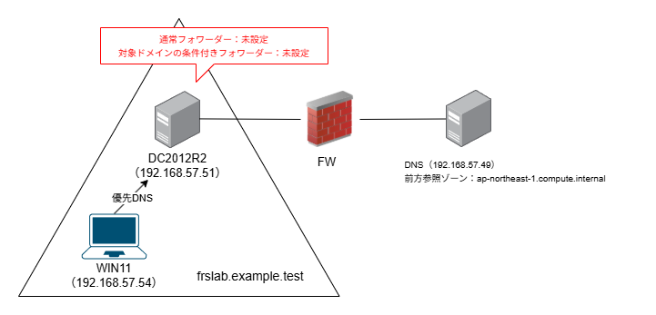
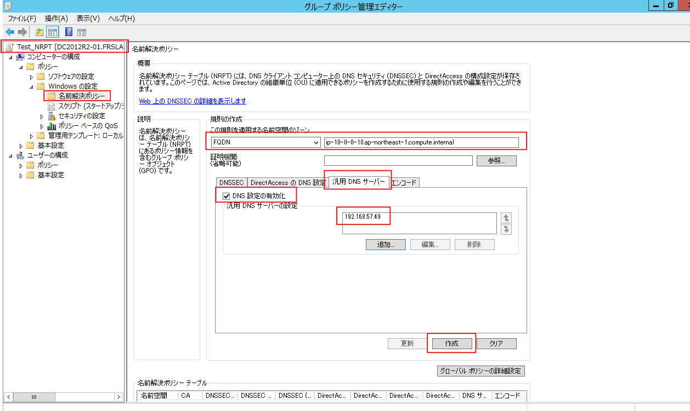
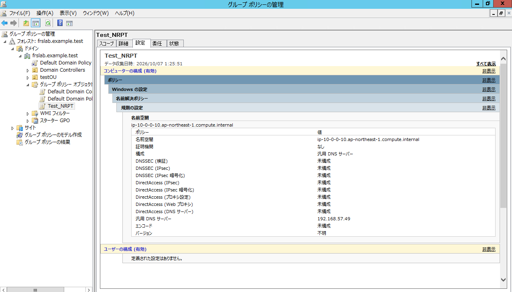
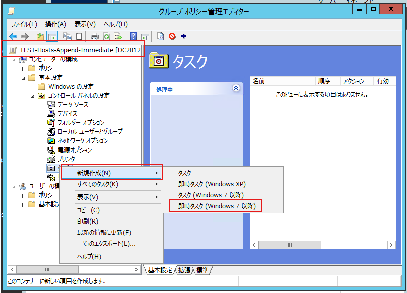
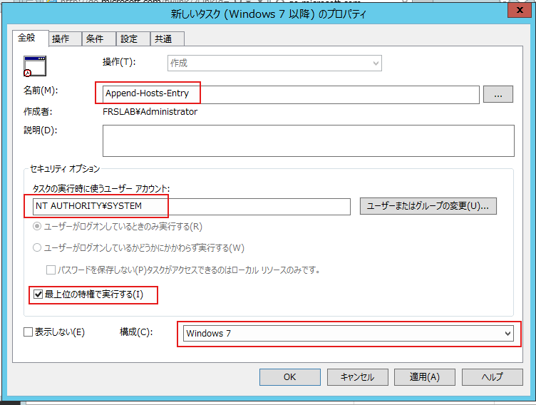
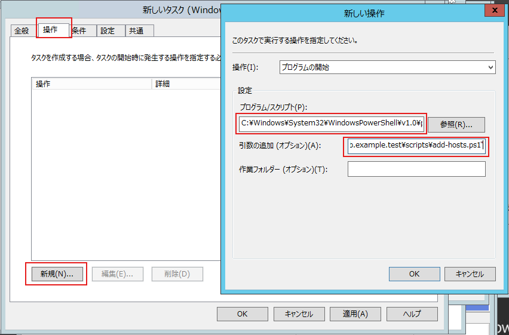
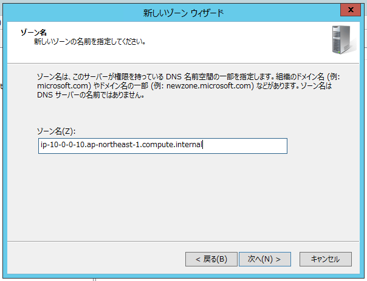
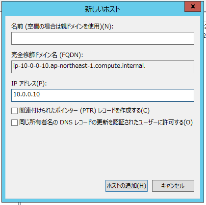

# 特定FQDNの名前解決を検証：NRPT・hosts・DNSゾーン追加の比較

## 検証の背景

実環境で発生している名前解決の問題を再現するため、以下の検証環境を構築した。



WIN11は、ADサーバ（DC2012R2）をDNSサーバとして使用している。別のDNSサーバ（192.168.57.49）は、ap-northeast-1.compute.internal の前方参照ゾーンを持ち、以下のAレコードを登録している。

| FQDN | IPアドレス |
| --- | --- |
| `ip-10-0-0-10.ap-northeast-1.compute.internal` | `10.0.0.10` |

<br>

WIN11に導入しているセキュリティ製品では、インストール時にプロキシサーバをIPアドレスで指定している。要件の変更に伴い、この指定をFQDNへ変更する必要が生じた。

しかし、DC2012R2には、対象FQDNを解決できるDNSサーバ（192.168.57.49）への通常フォワーダーや、対象ドメインの条件付きフォワーダーを設定していない。この構成では、DC2012R2・WIN11のいずれも通常の名前解決では対象FQDNを解決できない。一方、問い合わせ先として192.168.57.49を明示すると、10.0.0.10 が返る。

通常フォワーダーに192.168.57.49を設定する方法も考えられるが、対象ドメイン以外の問い合わせにも影響する可能性がある。そのため、今回は既存のDNS転送設定を変更せず、対象端末または対象FQDNに範囲を絞って対応する方法を検討する。

## 現状確認

まず、サーバ（DC2012R2）と端末（WIN11）で、対策前の名前解決の状態を確認する。  
対象FQDN `ip-10-0-0-10.ap-northeast-1.compute.internal` について、通常の名前解決では失敗し、問い合わせ先としてDNSサーバ（192.168.57.49）を明示すると `10.0.0.10` が返ることを確認する。

以下のコマンドは、サーバ・端末で、管理者権限で起動したPowerShellから実行する。

### サーバ（DC2012R2）

```powershell
# DNSサーバ側とDNSクライアント側のキャッシュを削除
Clear-DnsServerCache -Force
Clear-DnsClientCache

# 通常の名前解決：失敗することを確認
Resolve-DnsName ip-10-0-0-10.ap-northeast-1.compute.internal -Type A

# DNSを指定：10.0.0.10が返ることを確認
Resolve-DnsName ip-10-0-0-10.ap-northeast-1.compute.internal -Server 192.168.57.49 -Type A
```

### 端末（WIN11）

DNSクライアント側のキャッシュを削除してから、名前解決を確認する。

```powershell
# DNSクライアント側のキャッシュを削除
Clear-DnsClientCache

# 通常の名前解決：失敗することを確認
Resolve-DnsName ip-10-0-0-10.ap-northeast-1.compute.internal -Type A

# 問い合わせ先のDNSサーバを指定：10.0.0.10が返ることを確認
Resolve-DnsName ip-10-0-0-10.ap-northeast-1.compute.internal -Server 192.168.57.49 -Type A
```

## 解決策の比較

対象端末で対象FQDNを名前解決できるようにするため、以下の5案を検討した。  
案③は、スクリプトの実行に次回起動が必要となる。今回は再起動を伴わずに適用する方法を優先するため、検証対象から除外する。  
案④は、hostsファイル全体を置き換えるため、端末ごとに登録されている既存エントリが失われる可能性がある。今回は既存エントリを保持する必要があるため、こちらも検証対象から除外する。

以上より、今回は案①・②・⑤を検証する。

| 案 | 方法 | メリット | デメリット |
| --- | --- | --- | --- |
| **案①** | **GPOでNRPTを設定** | 対象端末・対象FQDNに限定して問い合わせ先を指定できる。hostsや独自スクリプトの管理が不要。 | 対象端末から指定DNSへの通信が必要。対象OS・製品がNRPTを利用できるか確認が必要。 |
| **案②** | **GPOの即時タスクでhostsを編集** | 再起動せずに適用できる。既存エントリを残し、必要な行だけ追加できる。 | スクリプトと実行結果の管理が必要。IP変更・削除への対応も必要。 |
| **案③** | **GPOの起動スクリプトでhostsを編集** | 起動時に設定を確認・追加できる。既存エントリを維持できる。 | 適用には次回起動が必要。案②と同様にスクリプトの管理が必要。 |
| **案④** | **GPOでhostsファイル全体を配布** | hosts編集用のスクリプトが不要。配布する内容を統一できる。 | 端末独自の既存エントリが上書きされる。IP変更時に配布ファイルの更新が必要。 |
| **案⑤** | **ADのDNSに前方参照ゾーンとAレコードを追加** | DNS側で一元管理でき、端末ごとの設定が不要。 | 同じDNSを利用する他の端末にも適用される。IP変更時のレコード更新と、ゾーンの影響範囲の確認が必要。 |

## 検証

### **案①：GPOでNRPTを設定**

TestNRPTというGPOを作成し、グループポリシー管理エディターで以下を開く。  
**［コンピューターの構成］→［ポリシー］→［Windows の設定］→［名前解決ポリシー］**  
対象FQDNの問い合わせ先を指定するため、以下のように設定する。

| 項目 | 設定値 |
| --- | --- |
| 名前空間の種類 | FQDN |
| 名前空間 | `ip-10-0-0-10.ap-northeast-1.compute.internal` |
| 設定するタブ | 汎用 DNS サーバー |
| DNS 設定の有効化 | チェックを入れる |
| 汎用 DNS サーバー | `192.168.57.49` |



［作成］をクリックし、画面下部の名前解決ポリシーテーブルに規則が追加されたことを確認する。

<br>

続いて、グループポリシーの管理画面で `Test_NRPT` の［設定］タブを開き、対象FQDNとDNSサーバが登録されていることを確認する。  


<br>

このGPOを、WIN11のコンピューターアカウントが含まれるOUへリンクする。その後、WIN11で管理者権限のPowerShellを起動し、以下を実行する。  
```powershell
# GPO更新
gpupdate /target:computer /force

# 適用されたNRPTを確認
Get-DnsClientNrptPolicy -Effective

# キャッシュを削除して名前解決を確認
Clear-DnsClientCache
Resolve-DnsName ip-10-0-0-10.ap-northeast-1.compute.internal -Type A
```

<br>

続いて、`Resolve-DnsName` で以下の結果が返ることを確認する。

```powershell
Name                                           Type   TTL   Section    IPAddress
----                                           ----   ---   -------    ---------
ip-10-0-0-10.ap-northeast-1.compute.internal   A      3600  Answer     10.0.0.10

```

これにより、DNSサーバをコマンドで明示しなくても、対象FQDNを `10.0.0.10` に名前解決できることを確認できた。

### **案②：GPOの即時タスクでhostsを編集**

案①を利用できない場合の代替策として、GPOの即時タスクでスクリプトを実行し、hostsに対象FQDNを追加する方法を検証する。  
案①の設定と切り分けるため、検証前に `Test_NRPT` のGPOリンクを無効にし、WIN11でGPOを更新する。`Get-DnsClientNrptPolicy -Effective` で、対象FQDNの規則が適用されていないことを確認する。

#### ① スクリプトの配置

DC2012R2上の以下のパスに、`add-hosts.ps1` を作成する。

```
C:\Windows\SYSVOL_DFSR\sysvol\frslab.example.test\scripts\add-hosts.ps1
```

<br>

スクリプトの内容は以下のとおりとする。既存エントリを保持し、対象FQDNが未登録の場合のみ追記する。

```powershell
$ErrorActionPreference = 'Stop'

$hostsPath = "$env:SystemRoot\System32\drivers\etc\hosts"
$targetIP = '10.0.0.10'
$targetName = 'ip-10-0-0-10.ap-northeast-1.compute.internal'

foreach ($line in Get-Content -LiteralPath $hostsPath) {
    # Ignore comments and split each entry into IP and host names.
    $fields = (($line -split '#', 2)[0].Trim() -split '\s+')

    if ($fields.Count -lt 2) {
        continue
    }

    if ($fields[1..($fields.Count - 1)] -contains $targetName) {
        if ($fields[0] -eq $targetIP) {
            # The correct entry already exists.
            exit 0
        }

        # Do not add a conflicting entry.
        throw "$targetName is already registered with IP $($fields[0])."
    }
}

# Preserve existing entries and append the new entry.
Add-Content -LiteralPath $hostsPath `
    -Value "`r`n$targetIP`t$targetName" `
    -Encoding ASCII
```

<br>

次に、WIN11のPowerShellで以下を実行し、SYSVOLの共有パスを通じてスクリプトが存在することを確認する。

```powershell
Test-Path "\\frslab.example.test\SYSVOL\frslab.example.test\scripts\add-hosts.ps1"
```

結果が `True` であることを確認する。

### ②テスト用GPO作成

テスト用のGPO `TEST-Hosts-Append-Immediate` を作成し、グループポリシー管理エディターで以下を開く。  
**［コンピューターの構成］→［基本設定］→［コントロール パネルの設定］→［タスク］**  
［タスク］を右クリックし、［新規作成］→［即時タスク（Windows 7 以降）］を選択する。今回の対象端末はWindows 11のため、この形式を使用する。



<br>

［全般］タブでは、以下のように設定する。  
| 項目 | 設定値 |
| --- | --- |
| 名前 | `Append-Hosts-Entry` |
| タスクの実行時に使うユーザーアカウント | `NT AUTHORITY\SYSTEM` |
| 最上位の特権で実行する | チェックを入れる |
| 構成 | Windows 7 |



<br>

次に、［操作］タブで［新規］をクリックし、以下のように設定する。

**操作：** プログラムの開始  
**プログラム／スクリプト：**

```
C:\Windows\System32\WindowsPowerShell\v1.0\powershell.exe
```

**引数の追加：**

```
-NoProfile -NonInteractive -ExecutionPolicy Bypass -File "\\frslab.example.test\SYSVOL\frslab.example.test\scripts\add-hosts.ps1"
```

**作業フォルダー：** 空欄

［OK］をクリックして操作を保存する。  


［条件］タブでは、アイドル状態・電源・ネットワークに関する実行制限のチェックをすべて外す。

また、［共通］タブの［一度だけ適用し、再適用しない］はチェックを入れない。これにより、GPOの処理時にスクリプトが再実行される。同じエントリがすでに存在する場合は、スクリプト側で追記を省略する。

設定を確認して［OK］をクリックし、このGPOをWIN11のコンピューターアカウントが含まれるOUへリンクする。案①のNRPT用GPOは、リンクを無効にしておく。

#### ③ GPOの適用と結果確認

既存のhostsエントリが保持されることを確認するため、GPO適用前に、WIN11の以下のファイルへテスト用エントリを追記する。編集は管理者権限で行う。  
```
C:\Windows\System32\drivers\etc\hosts
```

<br>

追記する内容は以下のとおりとする。

```
# test record
10.0.0.11 ip-10-0-0-11.ap-northeast-1.compute.internal
```

<br>

WIN11で管理者権限のPowerShellを起動し、hostsの内容を確認する。

```powershell
Get-Content "$env:SystemRoot\System32\drivers\etc\hosts"
```

テスト用のエントリが存在し、今回追加する `ip-10-0-0-10.ap-northeast-1.compute.internal` が未登録であることを確認する。

<br>

続いて、GPOを更新する。

```powershell
gpupdate /target:computer /force
```
<br>

即時タスクの実行後、再度hostsの内容を確認する。

```powershell
Get-Content "$env:SystemRoot\System32\drivers\etc\hosts"
```

<br>

以下は、実行後のhostsの該当部分である。

```powershell
# test record
10.0.0.11 ip-10-0-0-11.ap-northeast-1.compute.internal

10.0.0.10       ip-10-0-0-10.ap-northeast-1.compute.internal
```

<br>

既存のテスト用エントリが保持され、対象FQDNのエントリが追加されたことを確認できた。次に、DNSクライアント側のキャッシュを削除し、名前解決を確認する。

```powershell
# キャッシュを削除して名前解決を確認
Clear-DnsClientCache
Resolve-DnsName ip-10-0-0-10.ap-northeast-1.compute.internal -Type A
```

対象FQDNが `10.0.0.10` に名前解決できることを確認する。

<br>

最後に、再度 `gpupdate /target:computer /force` を実行し、タスクの再実行後も対象エントリが重複して追加されないことを確認する。

### 案⑤：ADのDNSに前方参照ゾーンとAレコードを追加

DC2012R2のDNSに、対象FQDNの前方参照ゾーンとAレコードを追加する。  
#### ① 検証前の準備

案①・②の設定が検証結果に影響しないよう、両方のGPOリンクを無効にし、WIN11でGPOを更新する。

```powershell
gpupdate /target:computer /force
Get-DnsClientNrptPolicy -Effective
```

<br>

対象FQDNのNRPT規則が適用されていないことを確認する。また、案②でhostsに追加した以下のエントリを削除する。既存エントリの保持確認に使用した `10.0.0.11` の行は残してよい。

```
10.0.0.10 ip-10-0-0-10.ap-northeast-1.compute.internal
```

GPOのリンクを無効にするだけでは、スクリプトで追記したhostsエントリは削除されないため、手動で削除する。

#### ② 前方参照ゾーンとAレコードの作成

DC2012R2のDNSマネージャーで［前方参照ゾーン］を右クリックし、［新しいゾーン］からゾーンを作成する。  
ゾーン名には、対象FQDN全体を指定する。

```
ip-10-0-0-10.ap-northeast-1.compute.internal
```

`ap-northeast-1.compute.internal` 全体のゾーンを作成する場合と比べ、DNS側で管理する名前空間の範囲を狭めることができる。



作成したゾーンを右クリックし、［新しいホスト（A または AAAA）］を選択する。以下のように設定し、［ホストの追加］をクリックする。

| 項目 | 設定値 |
| --- | --- |
| 名前 | 空欄 |
| 完全修飾ドメイン名（FQDN） | `ip-10-0-0-10.ap-northeast-1.compute.internal.` |
| IPアドレス | `10.0.0.10` |



名前欄を空欄にすることで、ゾーン名そのものに対応するAレコードを作成する。

#### ③ 名前解決の確認

WIN11で管理者権限のPowerShellを起動し、以下を実行する。

```powershell
# DNSクライアント側のキャッシュを削除
Clear-DnsClientCache

# DNSサーバを明示せずに名前解決を確認
Resolve-DnsName ip-10-0-0-10.ap-northeast-1.compute.internal -Type A
```

実行結果で、対象FQDNのAレコードとして `10.0.0.10` が返ることを確認する。
これにより、NRPTやhostsを使用せず、通常の問い合わせ先であるADのDNSを通じて対象FQDNを名前解決できることを確認できた。
なお、この方法は対象端末だけに限定されず、追加したゾーンを持つDNSサーバを利用するほかの端末にも影響する。