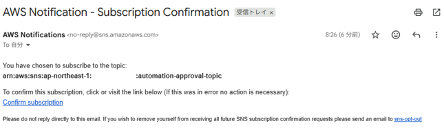
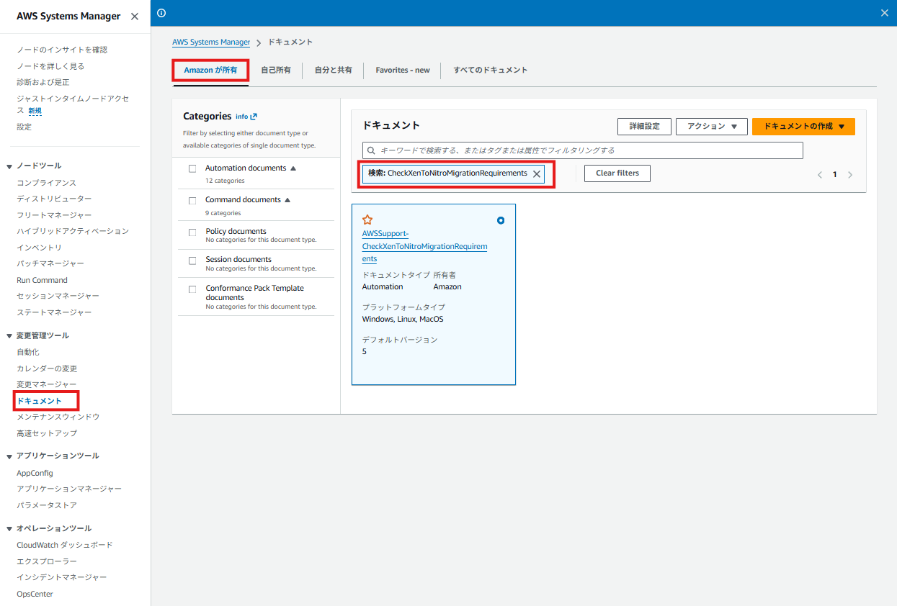
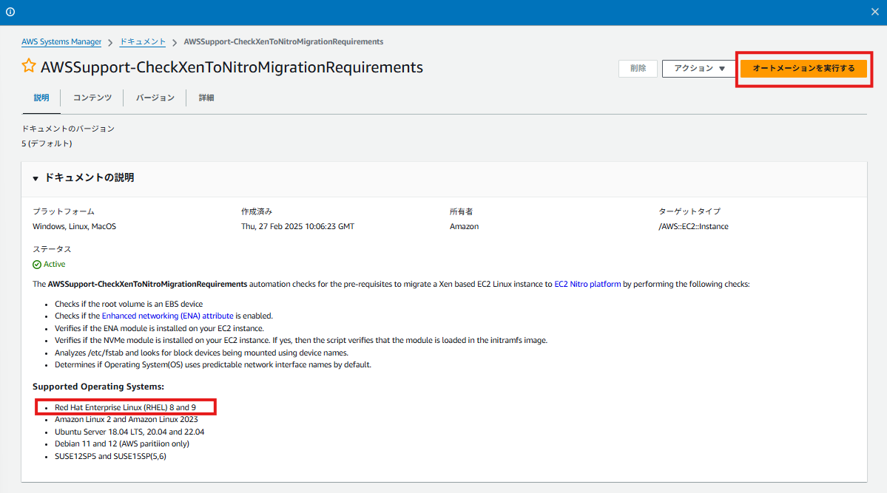
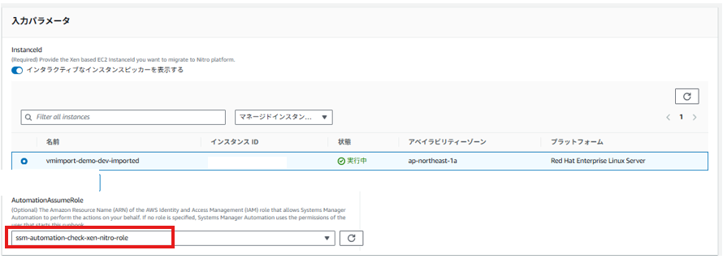
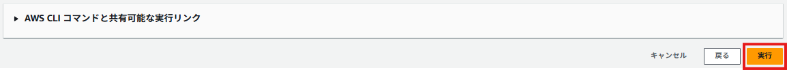
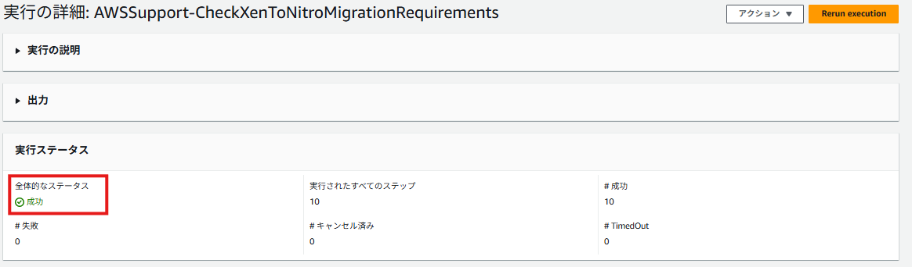
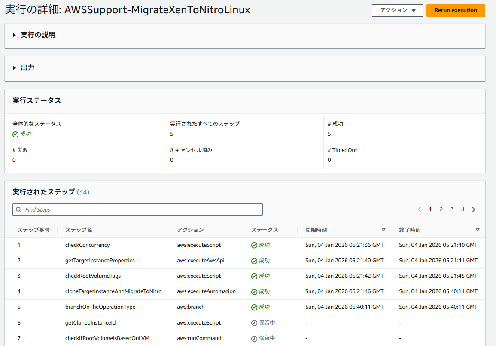
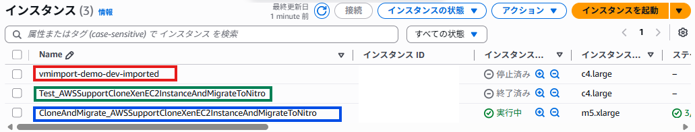

# Xen世代EC2からNitro世代EC2 へ移行-RHEL7.2

## 背景
業務において、Amazon EC2 上で稼働する RHEL 7.2 環境のミドルウェアサーバを運用している。本環境は Xen 世代のインスタンスタイプ上で稼働しており、AWS Compute Optimizer によるコスト最適化の提案を受け、インスタンスタイプの見直しが必要となった。

一方で、RHEL 7 はすでにサポートが終了しており、新規 AMI の作成や短期間での OS アップグレードは困難である。そのため、既存 OS を維持したまま、Xen 世代から Nitro 世代への移行を検証する必要があった。

Xen から Nitro への移行は単純なインスタンスタイプ変更ではなく、ENA や NVMe、initramfs など OS 側の要件を満たさない場合、起動やネットワーク疎通に失敗しやすい。そこで本検証では、AWS Support Automation Workflow（SAW）の Runbook を用いて事前要件の確認と対応手順を整理し、RHEL 7.2 環境における Nitro 世代への移行可否を検証する。


## 結論

- AWSSupport-MigrateXenToNitroLinux は、ENA ドライバを自動でインストールしない
- そのため、事前に AWSSupport-CheckXenToNitroMigrationRequirements を実行し、すべてのチェック項目が PASS となる状態を作ることが重要である
- 上記要件を満たした状態で AWSSupport-MigrateXenToNitroLinux を実行することで、RHEL 7.2 環境においても Xen 世代から Nitro 世代への移行が正常に完了することを確認した

## この記事で分かること

- ENAを導入してRHEL7.2をSAWでNitroへ移行する方法


## 前提条件

- OSがRHEL 7.2（Kernel：3.10.0-327.el7.x86_64）でXen 世代 EC2（例：c4 系）のEC2が存在すること
- AWS 側：SAW 実行に必要な IAM 権限（EC2/SSM Automation）を持つこと

## SAW（AWS Support Automation Workflows）とは

SAW（AWS Support Automation Workflows）は、AWS Systems Manager Automation をベースにした AWS 提供の Runbook 群で、一般的な運用作業（調査・修復・移行など）を手順化して自動実行できる。

本検証では、まず要件チェック Runbook（`AWSSupport-CheckXenToNitroMigrationRequirements`）で OS 側の不足（ENA/NVMe/GRUB 等）を洗い出し、対応後に移行 Runbook（`AWSSupport-MigrateXenToNitroLinux`）を実行した。なお SAW はあくまで “手順実行” であり、OS 内のドライバ導入（例：ENA）まで自動で行わないため、事前に要件を満たしておくことが重要である。  
参照：[https://pages.awscloud.com/rs/112-TZM-766/images/AWS-Black-Belt_2024_AWS-SAW-EC2-Nitro-Migration_0215_v1.pdf](https://pages.awscloud.com/rs/112-TZM-766/images/AWS-Black-Belt_2024_AWS-SAW-EC2-Nitro-Migration_0215_v1.pdf)


上記以外の方法として「nitro_check_script.sh スクリプトを実行し、前提条件を確認する」という手法もあるが、このスクリプトは2025/12現在、最終更新が約5年前でありメンテナンス状況が不明であるため本ランブックでのみ検証を行う。  
参考：[https://repost.aws/ja/knowledge-center/boot-error-linux-nitro-instance](https://repost.aws/ja/knowledge-center/boot-error-linux-nitro-instance)

OSの要件は以下から確認すること。  
[https://docs.aws.amazon.com/systems-manager-automation-runbooks/latest/userguide/automation-awssupport-migrate-xen-to-nitro.html](https://docs.aws.amazon.com/systems-manager-automation-runbooks/latest/userguide/automation-awssupport-migrate-xen-to-nitro.html)

## 実行前の準備（Runbook 実行に必要なもの）

- SAW（SSM Automation）を実行できる IAM 権限を用意する（EC2 操作・SSM Automation 実行など）。
    
    ※環境がなければ別記事「VirtualBox仮想マシンをAWS EC2に移行する」を参照し、EC2を作成する。この記事の内容に沿って環境を構築した場合、追加でSSMと通信するためのセキュリティグループやロールの設定が必要になるためTerraform設定ファイルに以下を追記する。
    
    ```hcl
    #SSMと通信するにはSGがエンドポイントと接続できる必要があるため、以下の穴あけをする
    resource "aws_security_group_rule" "allow_all_egress" {
      security_group_id = aws_security_group.ssh_sg.id
      type              = "egress"
      protocol          = "-1"
      from_port         = 0
      to_port           = 0
      cidr_blocks       = ["0.0.0.0/0"]
    
    ##SSMに必要なrole  
    # ---------------------------------------
    # IAM Role (Required) trust_poricy
    # ---------------------------------------
    data "aws_iam_policy_document" "ec2_trust" {
      statement {
        effect = "Allow"
    
        principals {
          type        = "Service"
          identifiers = ["ec2.amazonaws.com"]
        }
    
        actions = ["sts:AssumeRole"]
      }
    }
    
    resource "aws_iam_role" "ec2_ssm_role" {
      name               = "ec2_ssm_role"
      assume_role_policy = data.aws_iam_policy_document.ec2_trust.json
    }
    
    # ---------------------------------------
    # Attach the AmazonSSMManagedInstanceCore to Role
    # ---------------------------------------
    resource "aws_iam_role_policy_attachment" "ssm" {
      role       = aws_iam_role.ec2_ssm_role.id
      policy_arn = "arn:aws:iam::aws:policy/AmazonSSMManagedInstanceCore"
    }
    
    # ---------------------------------------
    # Create Instance Profile
    # ---------------------------------------
    resource "aws_iam_instance_profile" "ssm_ec2_profile" {
      name = aws_iam_role.ec2_ssm_role.name
      role = aws_iam_role.ec2_ssm_role.name
    }
    ```
    
    また、上記で作成したssm_ec2_profileに伴い、EC2インスタンスに以下の行を追加しておくこと
    
    ```hcl
      iam_instance_profile        = aws_iam_instance_profile.ssm_ec2_profile.name
    ```
    

terraform apply後、以下のコマンドでSSM登録状況を確認する。もしコマンドがうまくいかない場合、それはssm-agentが起動している状態でインスタンスプロファイルをアタッチしたからだと思われる。その場合はEC2のssm-agentを再起動すること

```hcl
##SSM登録状況確認
aws ssm describe-instance-information
```

- Runbook 実行中に承認／通知が必要になる場合があるため、**SNS Topic（通知先）**を事前に用意しておく。以下のTerraform設定ファイルを参照。
    
    ```hcl
    # ---------------------------------------
    # SNS
    # ---------------------------------------
    
    resource "aws_sns_topic" "automation_approval" {
      name = "automation-approval-topic"
    }
    
    resource "aws_sns_topic_subscription" "approval_mail" {
      topic_arn = aws_sns_topic.automation_approval.arn
      protocol  = "email"
      endpoint  = "<自身のメルアド>"
    }
    
    ```
    
    SNS設定後は以下のようなメールが飛んでくるため承認すること
    
    
    

### Runbook 別の注意点

- AWSSupport-CheckXenToNitroMigrationRequirements
    - 公式ドキュメントに記載の権限[ec2:DescribeInstanceTypes]はタイポしているので注意。
    - 公式ドキュメント：[https://docs.aws.amazon.com/ja_jp/systems-manager-automation-runbooks/latest/userguide/automation-awssupport-checkxentonitromigrationrequirements.html](https://docs.aws.amazon.com/ja_jp/systems-manager-automation-runbooks/latest/userguide/automation-awssupport-checkxentonitromigrationrequirements.html)

- AWSSupport-MigrateXenToNitroLinux
    - 公式ドキュメントに記載の権限だけでは、環境によっては不足があり そのまま実行すると失敗する（実際に検証して失敗した）。本検証では検証を先に進めるため、細かい権限調整は行わず **`AdministratorAccess` を付与して実行**した
    - 公式ドキュメント：[https://docs.aws.amazon.com/ja_jp/systems-manager-automation-runbooks/latest/userguide/automation-awssupport-migrate-xen-to-nitro.html](https://docs.aws.amazon.com/ja_jp/systems-manager-automation-runbooks/latest/userguide/automation-awssupport-migrate-xen-to-nitro.html)
    
    以上を踏まえ、ランブック実行のためのTerraform設定ファイルは以下となる。
    
    ```hcl
    # ---------------------------------------
    # IAM Role (iam_check_xen_to_nitro)
    # ---------------------------------------
    data "aws_iam_policy_document" "ssm_automation_trust" {
      statement {
        effect = "Allow"
    
        principals {
          type        = "Service"
          identifiers = ["ssm.amazonaws.com"]
        }
    
        actions = ["sts:AssumeRole"]
    
      }
    }
    
    resource "aws_iam_role" "ssm-automation-check-xen-nitro-role" {
      name               = "ssm-automation-check-xen-nitro-role"
      assume_role_policy = data.aws_iam_policy_document.ssm_automation_trust.json
    }
    
    data "aws_iam_policy_document" "iam_check_xen_to_nitro_role_policy" {
      statement {
        effect = "Allow"
        actions = [
          "ssm:DescribeAutomationExecutions",
          "ssm:DescribeAutomationStepExecutions",
          "ssm:DescribeAutomationStepExecutions",
          "ssm:DescribeInstanceInformation",
          "ssm:DescribeInstanceProperties",
          "ssm:StartAutomationExecution",
          "ssm:GetAutomationExecution",
          "ssm:GetDocument",
          "ssm:ListCommands",
          "ssm:ListCommandInvocations",
          "ssm:ListDocuments",
          "ssm:StartAutomationExecution",
          "ssm:SendCommand",
          "iam:ListRoles",
          "ec2:DescribeInstances",
          "ec2:DescribeInstanceTypes"
        ]
        resources = ["*"]
      }
    }
    
    resource "aws_iam_role_policy" "iam_check_xen_to_nitro_role_policy" {
      name   = "iam_check_xen_to_nitro_role_policy"
      role   = aws_iam_role.ssm-automation-check-xen-nitro-role.id
      policy = data.aws_iam_policy_document.iam_check_xen_to_nitro_role_policy.json
    }
    
    # ---------------------------------------
    # IAM Role (iam_migrate_xen_to_nitro)
    # ---------------------------------------
    resource "aws_iam_role" "ssm-automation-migrate-xen-nitro-role" {
      name               = "ssm-automation-migrate-xen-nitro-role"
      assume_role_policy = data.aws_iam_policy_document.ssm_automation_trust.json
    }
    
    data "aws_iam_policy_document" "iam_migrate_xen_to_nitro_role_policy" {
      statement {
        effect = "Allow"
        actions = ["*"]
        resources = ["*"]
      }
    }
    
    resource "aws_iam_role_policy" "iam_migrate_xen_to_nitro_role_policy" {
      name   = "iam_migrate_xen_to_nitro_role_policy"
      role   = aws_iam_role.ssm-automation-migrate-xen-nitro-role.id
      policy = data.aws_iam_policy_document.iam_migrate_xen_to_nitro_role_policy.json
    }
    ```
    

## Step1: AWSSupport-CheckXenToNitroMigrationRequirementsを実行し、FAILED を特定する

まず最初に、Nitro へ移行可能な状態かを機械的に判定するため、事前要件チェック Runbook を実行する。[AWS Systems Manager]-[ドキュメント]-[Amazonが所有]-検索窓で[CheckXenToNitroMigrationRequirements]で入力すると該当のランブックを表示できる



「オートメーションを実行する」を選択。ちなみに、[Supported Operating Systems]欄にはサポートしているOSがRHEL8と9のみの記載しかないが、[コンテンツ]タブの中を見てみるとRHEL7はサポートしているようなのでこのまま実行。



ランブック実行対象のインスタンスを選択し、AutomationAssumeRoleには先ほど作成した「ssm-automation-check-xen-nitro-role」を選択して、「実行」を選択





こんな感じで成功か失敗のステータスが表示される。失敗のステータスがある場合はエラー内容を見て修正のこと。



実行結果は以下。本検証では初回実行時に、以下の項目が FAILED となった。

- ENA attribute（enaSupport）が無効
- ENA driver が未導入
- biosdevname=0 が未設定

```
Total Number of Tests: 6

 1. Checking if the root volume is EBS: 
[PASSED] Root Volume attached with the instance is an EBS device.
 
 2. Determining if ENA Attribute is enabled:
[FAILED] Enhanced networking (ENA) attribute is NOT ENABLED on the EC2 Instance. Use the ModifyInstanceAttribute[1] API call or modify-instance-attribute[2] AWS CLI command to enable the enhanced networking enaSupport attribute.
 For more details, refer to the Enhanced networking (ENA) documentation[3].

       [1] https://docs.aws.amazon.com/AWSEC2/latest/APIReference/API_ModifyInstanceAttribute.html
       [2] https://docs.aws.amazon.com/cli/latest/reference/ec2/modify-instance-attribute.html|
       [3] https://docs.aws.amazon.com/AWSEC2/latest/UserGuide/enhanced-networking-ena.html#enable-enhanced-networking-ena-AL
 
 3. Checking ENA drivers status on the instance:
[FAILED] ENA Module is not installed on your instance. 
	- Please install ENA module before changing your EC2 instance type to nitro. Look at the following link for further guidance:
	> https://docs.aws.amazon.com/AWSEC2/latest/UserGuide/enhanced-networking-ena.html#enhanced-networking-ena-linux

 
 4. Checking NVME drivers status on the instance:
[PASSED] NVMe module is installed on instance for kernel version 3.10.0-327.el7.x86_64
[INFO] Checking if NVMe module loaded in initramfs/initrd
[PASSED] NVMe module is not blocklisted.
-rw-r--r--   1 root     root       112193 Jan  3 02:35 usr/lib/modules/3.10.0-327.el7.x86_64/kernel/drivers/block/nvme.ko
[PASSED] NVMe Module already loaded in initramfs/initrd for kernel version. 3.10.0-327.el7.x86_64 

 
 5. Checking FSTAB for entries with devices names:
[PASSED] FSTAB file looks fine and does not contain any entry with device names and are with UUID

 
 6. Determine if OS uses predictable network interface names by default:

[PASSED] Operating System is not using /etc/udev/rules.d/70-persistent-net.rules
[INFO] systemd/udev version on this EC2 instance is 219, which is greater than 197, carrying out additional checks. Systems that use systemd or udev versions 197 or greater can rename Ethernet devices and they do not guarantee that a single network interface will be named eth0. This behavior can cause problems connecting to your instance.

 [PASSED] The option net.ifnames=0 is present in /etc/default/grub file. No changes needed.
 
 [FAILED] The option biosdevname=0 is not present on the /etc/default/grub file. You can fix this using the following steps:

 *. Update the GRUB configuration file:
			 - sed -i '/^GRUB\_CMDLINE\_LINUX/s/\"$/\ biosdevname\=0\"/' /etc/default/grub 
 
 *. Rebuild GRUB:
			 - grub2-mkconfig -o /boot/grub2/grub.cfg (For Non-Debian systems)
			 - update-grub (For Debian systems)

	> For more details, please refer to the documentation - https://docs.aws.amazon.com/AWSEC2/latest/UserGuide/enhanced-networking-ena.html

 For more information about these checks, refer to AWS Premium Support Knowledge Center Article
https://aws.amazon.com/premiumsupport/knowledge-center/boot-error-linux-nitro-instance/
```

Nitro 世代では ENA を前提としたネットワーク初期化が行われるため、上記 FAILED（特に ENA driver / ENA attribute）は放置できない。以降の手順では、まず ENA を導入して initramfs に含め、次に ENA attribute を有効化し、Runbook が **ALL PASSED** になる状態を作る。

## Step 2. 重要な前提：`AWSSupport-MigrateXenToNitroLinux` は ENA を自動導入しない

Step 1 の要件チェックで ENA attribute / ENA driver が FAILED になっていたため、当初は移行 Runbook（`AWSSupport-MigrateXenToNitroLinux`）を実行すれば、これらの不足が自動的に解消されると考えていた。しかし実際には、Runbook をそのまま実行しても ENA 関連の FAILED は解消されず、試行錯誤に多くの時間を要した。

検証を進める中で分かったのは、`AWSSupport-MigrateXenToNitroLinux` は移行手順（クローン作成や Nitro への切り替え等）を自動化する Runbook であり、**OS 内の ENA ドライバを自動インストールするものではない**という点である。特に RHEL 7.2 のような古い環境では、パッケージ管理（yum）で素直に導入できないケースもあるため、`ena.ko` を自前で用意し、対象カーネルに導入した上で initramfs に確実に含める必要がある。

以降の手順では、まず ENA ドライバ（`ena.ko`）を用意し、`depmod` と `dracut` を用いて OS から認識できる状態にした上で、再度要件チェックを通過（ALL PASSED）させることを目標とする。

## Step 3. ENA ドライバ（ena.ko）を導入し、initramfs に含める

AWSSupport-CheckXenToNitroMigrationRequirements の ENA driver FAILED を解消するため、ena.ko を OS に認識させ、さらに initramfs に確実に含める。  
※ ena.ko 自体の作り方（make 等）は本手順では扱わないが、git clone [https://github.com/amzn/amzn-drivers.git](https://github.com/amzn/amzn-drivers.git)を行い、amzn-drivers/kernel/linux/ena配下でmakeを実行するのみである。

[ena.ko](./materials/ena.ko)

```bash
# ディレクトリ作成し、ena.koを配置
mkdir -p /lib/modules/3.10.0-327.el7.x86_64/kernel/drivers/net/ethernet/amazon/ena/

# ena.koが配置されていることを確認
ls -l /lib/modules/3.10.0-327.el7.x86_64/kernel/drivers/net/ethernet/amazon/ena/ena.ko

# modules.dep に ENA が載っていないことを確認
grep -R ena.ko /lib/modules/3.10.0-327.el7.x86_64/modules.dep

# modprobe できないことも確認（modprobe: FATAL: Module ena not found.であること）
modprobe -n ena

# depmod を実行し、モジュール依存関係を更新
depmod -a 3.10.0-327.el7.x86_64

# depmod 後：ENA が登録されたことを確認
grep -R ena.ko /lib/modules/3.10.0-327.el7.x86_64/modules.dep

# initramfs に ENA が入っていないことを確認
lsinitrd /boot/initramfs-3.10.0-327.el7.x86_64.img | grep ena

# dracut 設定で ENA を強制し、initramfs を再生成する
cat << 'EOF' > /etc/dracut.conf.d/ena.conf
add_drivers+=" ena "
EOF

dracut -f --kver 3.10.0-327.el7.x86_64

# initramfs に ena.ko が含まれていること(.../amazon/ena/ena.ko が表示される)
lsinitrd /boot/initramfs-3.10.0-327.el7.x86_64.img | grep ena

```

## Step 4. `biosdevname=0` を追加して NIC 名の揺れを抑える（再起動あり）

要件チェックでは `net.ifnames=0` が設定済みでも、追加チェックとして `biosdevname=0` が未設定の場合に FAILED になることがある。NIC 名の揺れによる疎通トラブルを避ける意味でも、本検証では `biosdevname=0` を追加して ALL PASSED を目指す。

```bash
# /etc/default/grubの中身確認
cat /etc/default/grub

# viコマンドでGRUB_CMDLINE_LINUX="..." の ダブルクォート内に biosdevname=0 を追加する。

# GRUB 設定を再生成する
grub2-mkconfig -o /boot/grub2/grub.cfg

# 再起動する

# 設定が反映されているか確認
cat /proc/cmdline | grep biosdevname
```

## Step 5. ENA attribute（enaSupport）を有効化する（AWS 側設定）

要件チェックの ENA attribute FAILED を解消するため、対象インスタンスの `enaSupport` を有効化する。

```bash
# インスタンスを停止する
aws ec2 stop-instances --instance-ids i-XXXXXXXX

# Ena Supportの状態確認
aws ec2 describe-instances \
  --instance-ids i-XXXXXXXX \
  --query 'Reservations[].Instances[].EnaSupport'

# ENA attribute を有効化する
aws ec2 modify-instance-attribute \
  --instance-id i-XXXXXXXX \
  --ena-support

# 有効化されたことを確認
aws ec2 describe-instances \
  --instance-ids i-XXXXXXXX \
  --query 'Reservations[].Instances[].EnaSupport'
```

## Step 6. 要件チェック Runbook を再実行し、ALL PASSED を確認する

Step 3〜5（ENA driver / biosdevname=0 / ENA attribute）の対応後に、再度 `AWSSupport-CheckXenToNitroMigrationRequirements` を実行して FAILED が解消されたかを確認する。下記のとおり、FAILDの結果は無くなった。

```
Total Number of Tests: 6

 1. Checking if the root volume is EBS: 
[PASSED] Root Volume attached with the instance is an EBS device.
 
 2. Determining if ENA Attribute is enabled:
[PASSED] Enhanced networking (ENA) attribute is ENABLED on the EC2 Instance.
 
 3. Checking ENA drivers status on the instance:
[PASSED] ENA Module with version 2.16.1g
3.10.0-327.el7.x86_64 is installed and available on your EC2 instance.

 
 4. Checking NVME drivers status on the instance:
[PASSED] NVMe module is installed on instance for kernel version 3.10.0-327.el7.x86_64
[INFO] Checking if NVMe module loaded in initramfs/initrd
[PASSED] NVMe module is not blocklisted.
	 1. Add NVMe drives to the dracut configuration files using the following commands:
			 - echo 'add_drivers+=" nvme "' >> /etc/dracut.conf.d/nvme.conf
			 - echo 'add_drivers+=" nvme_core "' >> /etc/dracut.conf.d/nvme_core.conf

	 2. Generate initramfs/initrd using the following command:
			 - sudo dracut -f -v

	 3. Generate modules and map files
			 - sudo depmod -a 

 
 5. Checking FSTAB for entries with devices names:
[PASSED] FSTAB file looks fine and does not contain any entry with device names and are with UUID

 
 6. Determine if OS uses predictable network interface names by default:

[PASSED] Operating System is not using /etc/udev/rules.d/70-persistent-net.rules
[INFO] systemd/udev version on this EC2 instance is 219, which is greater than 197, carrying out additional checks. Systems that use systemd or udev versions 197 or greater can rename Ethernet devices and they do not guarantee that a single network interface will be named eth0. This behavior can cause problems connecting to your instance.

 [PASSED] The option net.ifnames=0 is present in /etc/default/grub file. No changes needed.
 [PASSED] The option biosdevname=0 is present in /etc/default/grub file. No changes needed.

 For more information about these checks, refer to AWS Premium Support Knowledge Center Article
https://aws.amazon.com/premiumsupport/knowledge-center/boot-error-linux-nitro-instance/
```

## Step 7：`AWSSupport-MigrateXenToNitroLinux` を実行する（SNS Topic 入力あり）

要件チェックが ALL PASSED になったら、移行 Runbook を実行して Xen → Nitro の移行（クローン作成＋Nitro 起動）を行う。

### 入力パラメータ

- AutomationAssumeRole（任意）　IAMロールのARNを指定。検証では本項目は空白とし、AdministratorAccessを持ったユーザで実行。（※本来は上記で設定した[ssm-automation-migrate-xen-nitro-role]で実行したかったが、このロールでは権限が足りないため）
- NitroInstanceType（任意）
移行先の Nitro インスタンスタイプを入力する。サポートされているのは Nitro の M5、M6、C5、C6、R5、R6、T3 インスタンスのみ。今回はm5.largeを使用
- OperationType（必須）
Clone&MigrateかFullMigrationのどちらかを選択。
- SNSTopicArn（必須）
上記で作成したSNSトピックのARNを指定。確認コマンドは以下
    
    ```bash
    # SNS トピック一覧を表示するコマンド。上記で作成したARNが表示されるか確認
    aws sns list-topics
    ```
    
- ApproverIAM（必須）
アクションを承認または拒否できる AWS 認証済みプリンシパルのリストを指定。

- Acknowledgement（必須）

ランブック実行許可のために、[Yes, I understand and acknowledge]を入力。  
上記を踏まえ、ランブックを実行する。途中2回ほど、SNSトピックで指定した連絡先に[AWS Notification Message]が届くのでそれらを承認すること。


大体20分くらいで完了



コンソールを見ると三つのインスタンスができている。  
赤枠がクローン元のEC2,緑枠がクローン前のテスト時に作成されたEC2,青枠がクローン後のEC2である。



クローン後のEC2にSSHでログインできることを確認して完了。

## 結果

- 要件チェックで **ENA attribute / ENA driver / biosdevname=0** が FAILED だった。
- `ena.ko` を導入し **depmod → dracut（ENA強制）→ lsinitrd で確認**、さらに `enaSupport` 有効化と `biosdevname=0` 追加を行い、要件チェックを **ALL PASSED** にできた。
- その状態で `AWSSupport-MigrateXenToNitroLinux` を実行し、移行を進められるところまで到達した。

